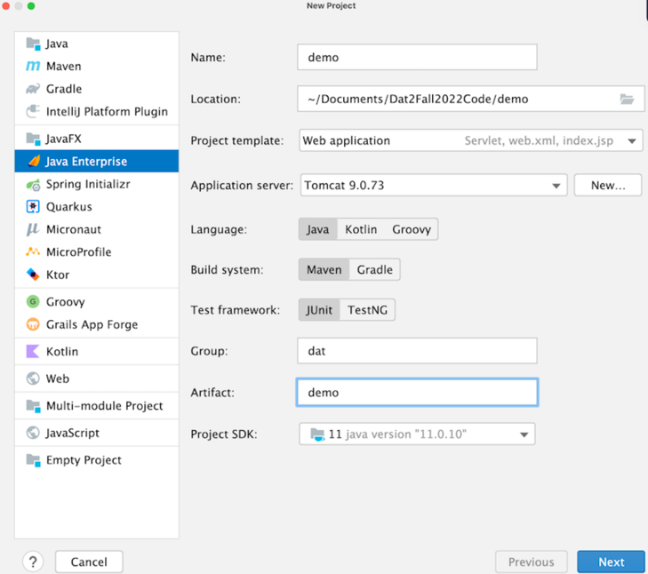
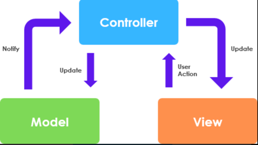

# Dokumentation
Dette er min egen dokumentation af Java Webstack. Vi skal lave et intranet 
og vil bruge denne dokumentation til bedre at kunne huske hvad vi lavede

## Start af et nyt webprojekt

1. Opret nyt projekt i IntelliJ
2. Vælg JavaEE projektskabelon
3. Java + Maven
4. Servlet dependencies 



## Arkitektur 

Vi anvender en slags MVC-pattern 



-M(odel) - Entiteter og hjælpe- metoder og klasser. Business-logic
-V(iew) - JSP og frontend (css, bootstrap mm)
-C(ontrol) - Servlets 

Husk! Ingen kommunikation mellem Model og View. Gå altid igennem controlleren.

## Opret GIT repo
```shell
git init
git add .
git commit -m "first commit"
git remote add origin git@github.com:PhilipHatley/intranet.git
git push -u origin main
```